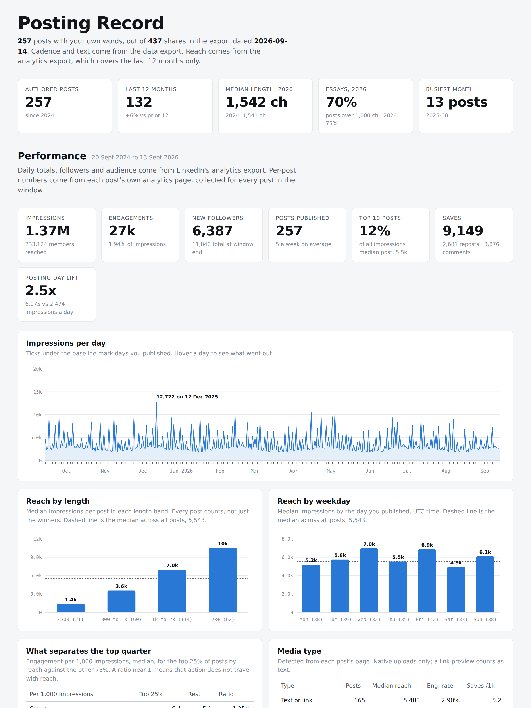

# LinkedIn Unpacked

LinkedIn personal advanced stats using Claude or OpenAI. Own-data analytics for LinkedIn creators. Every post you wrote, with the reach and engagement LinkedIn shows you but never lets you export, in two dashboards you can filter, and a weekly refresh that keeps history.

Built as an agent skill in the open [Agent Skills](https://developers.openai.com/codex/skills) format: it runs in Claude (desktop app with Claude in Chrome), ChatGPT desktop with Computer Use, Claude Code, Codex CLI, and the scripts run without any agent at all. An agent that can operate the browser you are logged into collects the numbers for you; anything else, you paste one script into DevTools once a week. No credentials are stored or asked for, the collector talks to nothing but linkedin.com, and the dashboards it builds make no external requests. Publishing a dashboard is the one step that puts your data on the internet, and it is always your call.

## What you get



*Synthetic data. Every number above comes from `tools/make-example-data.py`, not from a real account.*


**Posting Record.** Cadence since your first post, length distribution by year, when you publish, topic drift, hashtags by era. Then the performance layer: impressions per day with your publish days marked, reach by length band and weekday, what separates your top quarter (saves and sends, in most accounts), media type, followers, audience, quarterly trends, a series tracker, and a searchable archive with every post's numbers.

**Post Explorer.** Pick an outcome (impressions, saves per 1k, engagement rate, comments, reposts, followers gained), filter by topic, weekday, media and length, and see the scatter, the topic-by-length and weekday-by-hour matrices, Spearman correlations across 19 features, controlled comparisons within length bands, and topic trends by month.

**A query database for you or your LLM.** `db.py` writes `posting-record.sqlite`: every post with its local publish time, length band, topics, media, link placement and latest numbers, every dated collection for reach curves, the account's daily series and audience, the series editions, and precomputed medians by length band, weekday, topic, media, quarter and link placement (raw and within length bands), top-quartile-vs-rest ratios and Spearman correlations. Column docs live inside the file (`schema_notes`) and next to it (`posting-record.schema.md`), so any agent with SQL can answer "which of my SOAR posts over 2k chars did best and what did they open with" without the dashboards.

**Posting Report.** One document from the database: cadence, reach drivers within length bands, what travels with reach, topics and media, quarterly trend, reach over time, a dedicated section for your series with every edition's numbers and full text, best posts, and the sortable archive. Regenerated by the weekly run.

**Weekly refresh and reach curves.** A scheduled Claude task discovers new posts, re-collects every post's numbers, keeps a dated snapshot, rebuilds and republishes, and sends a five-line report. Each snapshot adds a point to every post's curve: the Reach over time section plots impressions by days since publishing, lists what grew most since the previous collection, and, once enough posts have both early and late points, shows what share of a post's day-28 reach arrives by day 1, 3, 7 and 14. LinkedIn's own analytics never show this.

## Why it exists

LinkedIn gives creators three partial views: a data export with text but no numbers, an analytics export with daily totals and only the top 50 posts, and a per-post analytics page with everything but no export. Nothing joins them. This joins them, on your machine, for your posts only.

## Works with

| | Parse and build | Collect per-post metrics | Weekly refresh | Dashboards |
|---|---|---|---|---|
| **Claude desktop + Claude in Chrome** | yes | automatic: runs the script inside your logged-in tab | scheduled task, bound to your computer | published as artifacts, stable links |
| **ChatGPT desktop with Computer Use** (macOS, Windows) | yes | automatic through the screen: opens DevTools in your logged-in browser, pastes the script, runs `PR.download()` | no scheduler in ChatGPT per OpenAI's docs; ask it each week | `dist/*.html`, open or host anywhere |
| **Claude Code, Codex CLI** | yes | you paste collector.js in DevTools, run `PR.download()`, point the agent at the file | cron on `weekly.py` after the file lands | same |
| **No agent** | `python3 scripts/...` | same DevTools paste | same | same |

The difference between the two automatic rows: Claude in Chrome executes JavaScript in the tab directly and reads the result back as text, so it needs no clicking. ChatGPT's Computer Use operates your logged-in browser through the GUI, per [OpenAI's documentation](https://learn.chatgpt.com/docs/computer-use), so it does the same steps a person would: open the console, paste, run, and save the dump with `PR.download()`, then `weekly.py` takes the downloaded file directly. The ChatGPT path is written from the documentation, not from a run; report what you hit.

## What you need

- Chrome logged into LinkedIn. For the automatic path, the Claude desktop app with the **Claude in Chrome** extension.
- Python 3.10+. The only third-party dependency is `openpyxl` (`pip install -r requirements.txt`), and only for the analytics xlsx. Everything else is the standard library.
- Your LinkedIn data export (Settings > Data privacy > Get a copy of your data). Optional: the analytics export from `linkedin.com/analytics/creator/content/`.

## Install

1. Claude desktop: add the `skill/linkedin-post-analytics` folder to your skills, or point Claude at this repo. Claude Code and Codex CLI pick the skill up automatically from `.claude/skills/` and `.agents/skills/` when you open the repo.
2. Pick a workspace folder for your data. Copy `config.example.json` there as `config.json` and set your handle, timezone, series rule and topics.
3. Tell Claude: "Set up my LinkedIn post analytics from this export" and hand it the zip. The skill walks through the rest: parse, collect, build, publish, and optionally schedule the weekly run.

Manual path, no Claude:

```bash
cd my-workspace
python3 /path/to/scripts/prepare.py ~/Downloads/Complete_LinkedInDataExport.zip
python3 /path/to/scripts/analytics.py ~/Downloads/AggregateAnalytics_....xlsx   # optional
# collect per-post metrics by hand: open linkedin.com/analytics/creator/content/ in the browser you are logged into,
# open DevTools (Cmd+Option+J), paste scripts/collector.js, then run
#   PR.start({known: [], seed: [<share ids from posts.json for the last 12 months>], profile: 'your-handle'})
# wait until PR.status() says running: false, then run PR.download()  (saves posting-record-dump-<date>.txt)
python3 /path/to/scripts/weekly.py ~/Downloads/posting-record-dump-2026-09-14.txt
open dist/posting-record.html dist/post-explorer.html
sqlite3 posting-record.sqlite "SELECT * FROM stats_by_length_band"   # or hand the file to any LLM with a SQL tool
```

## Layout

```
config.example.json          profile, timezone, series rule, topic regexes, dashboard URLs
scripts/
  prepare.py                 data export -> posts.json
  analytics.py               analytics xlsx -> analytics.json
  collector.js               runs in your logged-in LinkedIn tab; discovers and collects per-post metrics
  weekly.py                  merges a collector run, keeps snapshots, rebuilds
  series.py                  recurring series export (<slug>.json/.csv) for a website
  build.py                   fills templates/ with your data -> dist/
  db.py                      everything above -> posting-record.sqlite + posting-record.schema.md
  report.py                  the database -> dist/posting-report.html, one document with a dedicated series section
  pr_common.py               config and workspace helpers
templates/                   the two dashboards with __PLACEHOLDERS__
skill/linkedin-post-analytics/   canonical home: SKILL.md (open Agent Skills format), scripts/, templates/
scripts/, templates/             symlinks into the skill folder, so the paths above work from the repo root
.claude/skills/, .agents/skills/ symlinks to the skill, where Claude Code and Codex CLI look for it
docs/APP-REQUIREMENTS.md     if you want to turn this into a standalone app
tools/make-example-data.py   generates a synthetic workspace for the screenshot, demos and testing
```

Workspace files after a run: `posts.json`, `analytics.json`, `post_metrics.json`, `<series>.json`, `snapshots/`, `runs/`, `dist/`, `posting-record.sqlite` and `posting-record.schema.md`.

## How the collector works, and the terms question

The collector runs inside your browser session and only touches pages you can already open: your activity page, your post pages, and the analytics page of each of your posts. It reads server-rendered HTML with `fetch`, one request every 1.5 seconds or so, about 4 seconds per post. It never touches other people's posts, never stores credentials, and never posts, reacts or messages.

Automating your own account is a grey area under LinkedIn's User Agreement. Read it and decide for yourself. The rate is deliberately slow and the scope deliberately narrow.

Two details that make it work without manual exports: LinkedIn ids embed the publish timestamp (`id >> 22` is milliseconds since epoch), and your activity page is server-rendered with the last 30 or so activities. The share id on a post page can differ from the one in your export for the same post; the activity id is the stable key throughout.

## Analysis rules baked into the dashboards

Medians, never means. Every cell shows its n, small cells are faded. Length confounds everything, so day, topic, media and link-placement claims are shown within length bands. Topics are regexes you edit. Correlations are Spearman and labelled as direction, not cause.

## Publishing your dashboards

`dist/posting-record.html`, `dist/post-explorer.html` and `dist/posting-report.html` are self-contained: the dataset is inlined and the pages load no fonts, scripts or styles from anywhere. Opened locally they touch the network zero times.

Publishing one, as a Claude Artifact or on any static host, puts the full text and the full numbers of every post you have written on a URL. That is usually the point, and it is still worth saying out loud. If you only want the analysis, keep the files local and skip the publish step. If you do publish, the link is the access control, so treat it that way.

## Security

Reporting a vulnerability: see [SECURITY.md](SECURITY.md).

The collector runs with your LinkedIn session and this repo ships instructions that agents load automatically, so the threat model is written down rather than assumed:

- Every URL the collector fetches has a hardcoded `https://www.linkedin.com/` prefix. No config value can redirect a credentialed request to another host.
- Config values are escaped for the context they land in before they reach a published page. `scripts/build.py` has the details.
- Scripts read and write the workspace folder only.
- No GitHub Actions, no npm, no lockfile, one pinned Python dependency.

## License

MIT.
